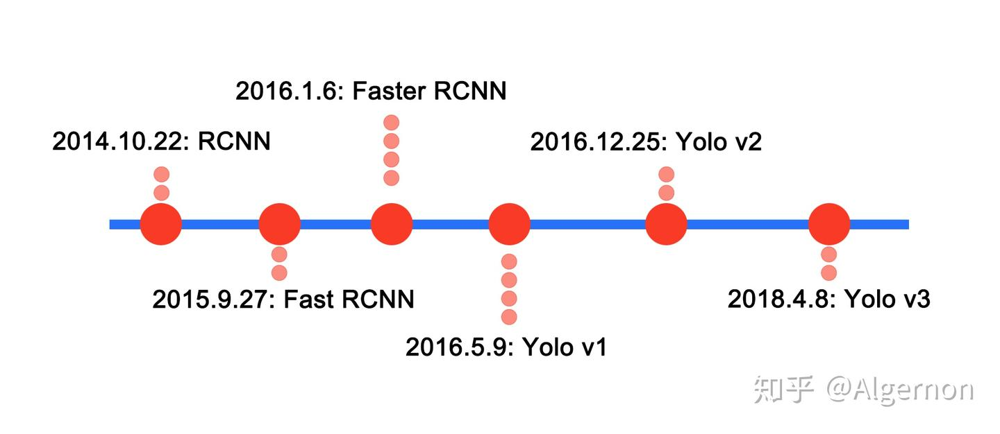
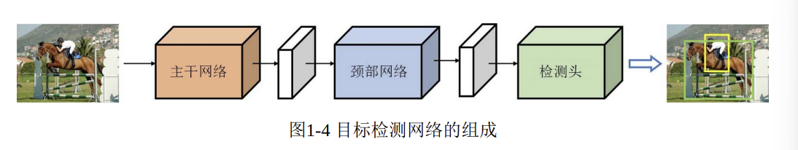
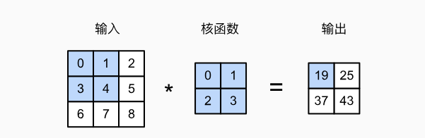
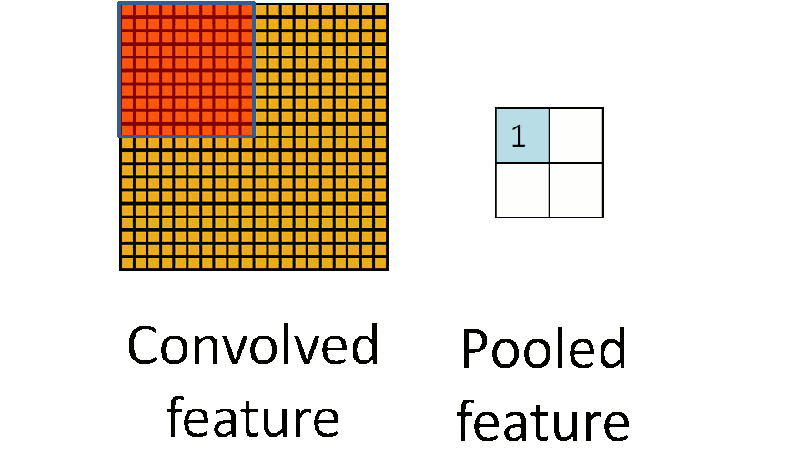
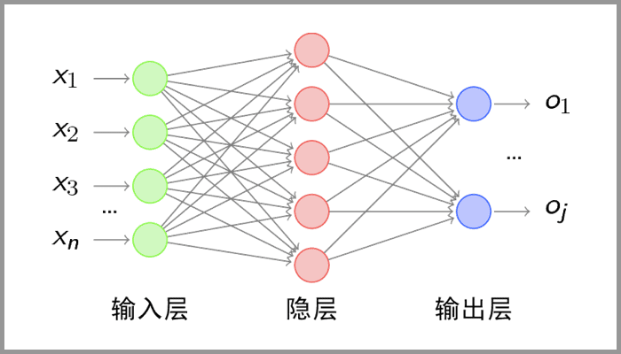
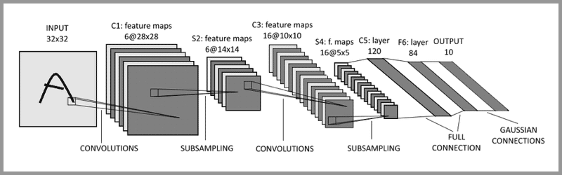
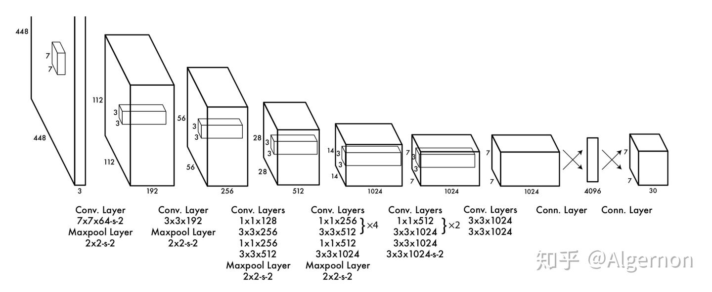
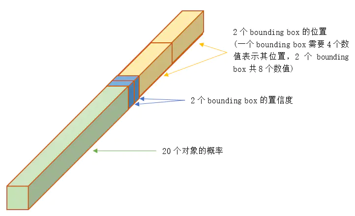

# 目标检测的发展阶段

目标检测：在图像中识别出物体的位置并分类。

两阶段(R-CNN)：先提取出可能包含目标的区域，再依次对每个区域进行识别，因此速度较慢精度较高。

单阶段(YOLO)：只需要一次特征提取就可以实现目标检测，Yolo并没有真正去除候选区，而是采用了预定义的预测区，以yolov1为例，预先划分了49个网格，每个网格允许预测出两个边框。

# 目标检测网络框架概述

一个常见的目标检测网络往往可以分为三大部分：主干网络，颈部网络和检测头

- 主干网络：目标检测网络中最核心的部分，提取输入图像中的高级特征，减少图像中的冗余信息，以便后续网络做深入才处理。

- 颈部网络：将主干网络输出的特征进行而二次处理。

- 检测头：提取类别信息和位置信息，输出最终的预测结果。

# 卷积神经网络

当使用全连接神经网络处理大尺寸图象时，有三个明显的特点：

1. 将图像展开为向量会丢失空间信息
2. 参数过多效率低下，训练困难
3. 大量的参数会导致网络过拟合

假设我们有一个足够充分的照片数据集，数据集中是拥有标注的照片，每张照片具有百万级像素，这意味着网络的每次输入都有一百万个维度。即使将隐藏层维度降低到1000，这个全连接层也将有$10^6×10^3$=$10^9$个参数。

卷积神经网络由三部分组成：

1. 卷积层：提取图像特征
2. 池化层(下采样)：降维，防止过拟合，降低卷积层对边缘的敏感性。
3. 全连接层：计算并输出

卷积神经网络各层中的神经元是三维排列的：宽度，高度和深度

- 感受野：网络中某一层的某一个神经元在输入图像上所看到的区域大小	
- 权值共享：卷积运算中采用权值共享可以有效减少需要求解的参数
- 分辨率指的是输入模型的图像尺寸(长宽)

卷积表达的是互相关运算，它通过在输入图像上滑动不同的卷积核并执行一定的运算产生一组平行的特征图。一张特征图中的元素都是通过一个卷积核计算得出的，即一张特征图共享了相同的权重和偏置项

将窗口对应的位置与核函数对应相乘，然后求和取得输出。这种方式会丢失边缘特征，因此通过padding扩充原图像(补0)，然后再提取特征。

具体应用中往往会有多个卷积核，每个卷积核代表了一种图像模式

池化层的操作主要有**最大池化**和**平均池化**

如下所示的是对20*20的卷积层用10\*10的窗口进行池化操作

经过卷积层和池化层处理过的数据塞给全连接层

典型的CNN并非只有三层结构，而是多层结构，以LeNet-5为例

卷积层-池化层-卷积层-池化层-卷积层-全连接层

# Yolo

Yolo是一种基于深度学习的实时目标检测算法，其核心理念在于将目标检测任务转换为一个单一的回归模型，从输入图像直接预测目标的类别和边界框。与传统的两阶段检测器不同，Yolo将图像划分为S*S的网格，每个网格负责预测一定数量的边界框以及这些框内物体的置信度和类别。

Yolo的发展历程

+ Yolov1：YOLO的初代版本，提出了将目标检测减缓为回归问题的创新思路
+ Yolov2：引入了批归一化，Anchor Boxes等技术，极大的提高了模型的稳定性和检测精度。
+ Yolov3：引入了新的特征提取网络Darknet-53，并采用了多尺度检测方法，使得模型在不同大小的目标检测上表现得更为出色。
+ Yolov4：结合了诸如CSPNet、Mish激活函数等最新的网络结构与优化方法，在保证检测速度的同时进一步提高了精度。
+ ...

Yolov1的网络结构，输入图像的大小是448*448，经过若干个卷积层和池化层，变为7\*7\*1024，最后经过两层全连接层，输出张量维度为7\*7\*30.

输出的维度中

+ 7*7：表示将图像分为7\*7=49个格子，如果一个物体的中心落在了某个格子，这个格子就负责检测这个物体，好比有49个员工负责检测物体。
+ 30：每个员工检测的内容，Yolo v1论文中，30是由(4+1)∗2+20得到的，这里的(4+1)表示矩形框的中心点坐标x,y，长宽w,h以及是否属于被检测物体的置信度c，2代表一个格子预测出2个矩形框，最终输出置信度最大的那个框，每个方格只能预测一个物体(因此对临近的小物体预测效果不好)，20代表预测20个类别。

Yolo采用了一些列关键技术来实现高雄啊的目标检测

+ Anchor Boxes：预定义的边界框集合，用于处理不同大小和形状的目标
+ NMS：用于消除多个重叠的边界框，保留置信度最高的

Yolo v1使用梯度下降作为优化器，损失函数为
$$
\begin{aligned}
\mathcal{L} =\ &\lambda_{\text{coord}} \sum_{i=0}^{S^2} \sum_{j=0}^{B} \mathbb{1}_{ij}^{\text{obj}} \left[ (x_i - \hat{x}_i)^2 + (y_i - \hat{y}_i)^2 \right] \\
&+ \lambda_{\text{coord}} \sum_{i=0}^{S^2} \sum_{j=0}^{B} \mathbb{1}_{ij}^{\text{obj}} \left[ (\sqrt{w_i} - \sqrt{\hat{w}_i})^2 + (\sqrt{h_i} - \sqrt{\hat{h}_i})^2 \right] \\
&+ \sum_{i=0}^{S^2} \sum_{j=0}^{B} \mathbb{1}_{ij}^{\text{obj}} (C_i - \hat{C}_i)^2 \\
&+ \lambda_{\text{noobj}} \sum_{i=0}^{S^2} \sum_{j=0}^{B} \mathbb{1}_{ij}^{\text{noobj}} (C_i - \hat{C}_i)^2 \\
&+ \sum_{i=0}^{S^2} \mathbb{1}_i^{\text{obj}} \sum_{c \in \text{classes}} (p_i(c) - \hat{p}_i(c))^2
\end{aligned}
$$

输入各部分的含义：

- S：将图像划分为$S \times S$个网格
- B：每个格子预测B个边界框
- $\mathbb{1}_{ij}^{\text{obj}}$：第$i$个网格的第$j$个边界框是否负责预测该目标（即 IOU 最大）
- $\mathbb{1}_{ij}^{\text{noobj}}$：对应的框不负责任何目标
- $x, y$：边界框中心点在网格中的坐标（归一化）
- $w, h$：边界框宽高（归一化）
- $C$：置信度，表示该框是否包含目标及其预测准确性（即 IOU）
- $p(c)$：给定目标存在的前提下，某个类别 $c$ 的条件概率

损失函数中的每一部分；

1. 第一项计算预测框中心点的损失

2. 第二项计算预测框宽高的损失，公式中取根号是为了消除大尺寸框和小尺寸框的差异

3. 第三项和第四项是预测框的置信度C，如果网格中存在目标，且预测框负责检测这个目标，那么就会计算它的置信度损失，$C$=$P(object)⋅IOU$，其中

   1. $P(\text{object})$：这个框包含目标的概率（0 或 1）
   2. $\text{IOU}$：这个预测框和 ground truth 的交并比

   如果不存在也要计算置信度且置信度应该≈0

4. 最后一项，对于有目标的网络，模型预测的类别概率与真实类别之间的差距

损失函数中的超参数

- $\lambda_{\text{coord}} = 5$：加大对坐标预测的关注。
- $\lambda_{\text{noobj}} = 0.5$：降低对背景误判的惩罚。

