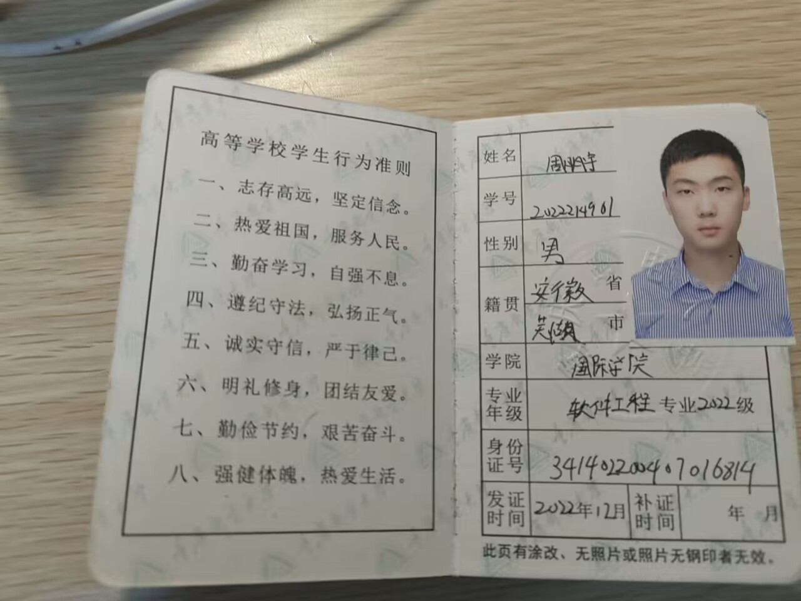
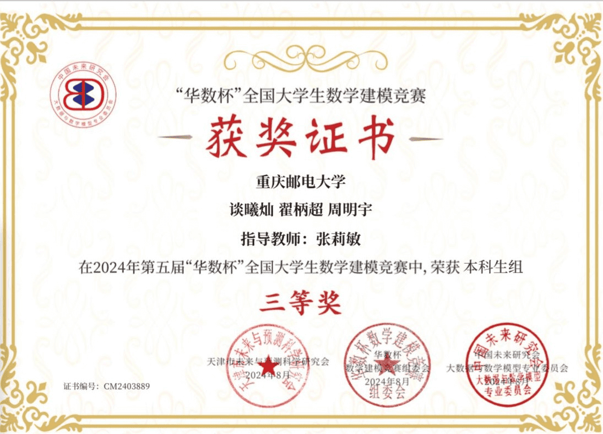
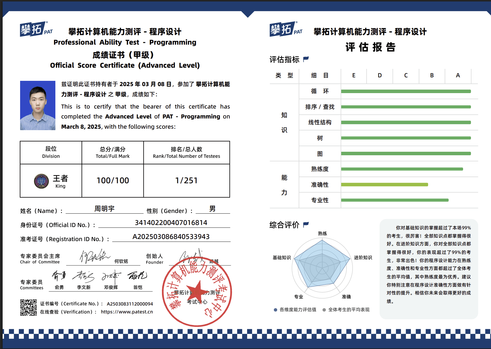

# 身份证

Specifically, I hope to join research projects under the guidance of my supervisor as early as possible and strive to produce tangible results, aiming to publish high-quality papers. On one hand, this will enhance my research capabilities; on the other, it will help me evaluate whether I find academic research meaningful and fulfilling enough to pursue long-term. If I discover that I truly enjoy and excel at research, I will consider applying for a Ph.D. abroad to immerse myself in a more advanced academic environment. If not, I will begin preparing for industry roles early and aim to work in a leading tech company where I can fully leverage my engineering strengths.

I maintain an open mindset about the future and am determined to approach graduate study with a practical attitude. I won’t set rigid expectations or idealize outcomes but will let my actual performance and experience guide my future path

# 学生证

# 个人陈述

## 中文

### 本科经历：

我本科就读于重庆邮电大学软件工程专业，在专业排名中位列第3/102，GPA为3.60/4.00，连续获得校级奖学金。在课程学习方面，我注重打牢基础、拓展能力，核心课程如《数据库系统》《程序设计原理》《计算机网络》《操作系统》等均取得90分以上的优异成绩，形成了扎实的理论功底与良好的逻辑思维能力。

英语方面，我已通过全国大学英语四级（537 分）和六级（466 分）考试，并在全国大学生英语竞赛（NECCS）中获得全国二等奖，具备较强的英文文献阅读和学术写作能力，能够胜任研究生阶段对英文资料的查阅与科研文献的学习需求。

此外，我曾获得多项校级和国家级奖项，包括蓝桥杯全国二等奖、百度之星程序设计大赛重庆市金奖、中国高校计算机大赛团体程序设计天梯赛全国二等奖、全国大学生英语竞赛二等奖等。这些经历不仅丰富了我的大学生活，也锻炼了我的实战能力与抗压能力。

### 个人能力

在本科阶段，我注重理论学习与实践能力并重，积极将课堂所学应用于项目开发与科研探索中，持续打磨自己的工程能力与系统思维。

在软件开发方面，我独立设计并实现了一个功能完备的社交博客系统。该项目基于 Flask 框架开发后端，支持用户注册、登录、发布博客、评论、关注等一系列社交功能，前后端集成流畅。系统采用蓝图机制进行模块化设计，有效分离用户管理、内容管理、评论系统等功能模块，并通过 Docker 实现容器化部署，确保在不同平台间的一致性与可移植性。该项目不仅提升了我的全栈开发与工程实现能力，也深化了我对系统架构与模块化设计的理解。

在数据建模与人工智能方向，我参与多个分类与预测任务。在 Kaggle Titanic 项目中，我系统完成了从数据预处理、特征构建、模型训练到参数调优的全流程，通过逻辑回归、随机森林、SVM 等多种模型对比实验，最终构建出泛化能力优良的生存预测模型。此外，我还参与“量子计算与深度学习融合在图像分类与特征选择中的研究”，采用量子启发式模拟退火算法进行特征选择，并结合逻辑回归完成信用评分建模，在 APMCM 建模竞赛中获得全国二等奖。这些实践增强了我对数据驱动建模、模型优化与算法可解释性的理解。

在科研探索方面，我对系统可靠性与软件质量保障方向尤为关注，曾尝试搭建内核模糊测试平台 Syzkaller，并深入调试其在 QEMU 虚拟环境中的运行过程。这一过程涉及 Linux 内核构建、虚拟机网络配置、SSH 无密码连接与自动化测试脚本的集成，虽然困难重重，但极大地锻炼了我的调试能力与问题定位能力，也让我初步接触到系统级测试的研究路径。

我也十分重视团队合作与组织协调能力的培养。曾担任班长、学习小组组长，组织多次学风建设与学术分享活动，具有良好的沟通协作能力与集体责任感。此外，我在校外积极参与志愿服务，服务时长累计超过100小时，荣获“优秀志愿者”称号，展现了较强的社会责任感与执行能力。

### 研究生阶段规划

我的研究生阶段目标非常明确：就是通过真实的科研训练，看自己是否真正适合走科研这条路。

具体来说，我希望能在导师的指导下尽早参与到具体的科研项目中，脚踏实地做出一些成果，争取发表高质量论文。一方面，这能帮助我提升研究能力，另一方面，也能让我更清楚地判断：科研这件事是否让我感到投入、有价值，是否愿意长期为之付出。如果在研究过程中我发现自己确实热爱科研、有能力坚持下去，我会考虑继续深造，申请出国读博，去接触更高水平的学术环境；如果发现自己不太适合长期从事科研，那我也会尽早准备就业，争取进入一家有挑战的大厂工作，将自己的工程能力发挥出来。

我对未来保持开放，也愿意在研究生阶段脚踏实地走好每一步，不给自己设限，也不盲目理想化，而是以实际表现来决定未来方向。

## English

### Undergraduate Experience

I completed my undergraduate studies in Software Engineering at Chongqing University of Posts and Telecommunications, ranking 3rd out of 102 students in my program with a GPA of 3.60/4.00. I consistently received university-level scholarships. In terms of coursework, I placed great emphasis on both building a solid foundation and expanding my skill set. I achieved outstanding grades (above 90/100) in core courses such as *Database Systems*, *Principles of Programming*, *Computer Networks*, and *Operating Systems*, which laid a strong theoretical foundation and enhanced my logical thinking abilities.

In English proficiency, I have passed both the CET-4 (537) and CET-6 (466) examinations, and was awarded the Second Prize in the National English Competition for College Students (NECCS). These achievements demonstrate my solid academic English skills, enabling me to effectively read academic literature and engage in research work during graduate studies.

I have also received various honors and awards at both university and national levels, including the Second Prize in the Lanqiao Cup National Software Competition, the Gold Award in the Baidu Star Programming Contest (Chongqing region), the Second Prize in the National College Student Programming Ladder Tournament, and the Second Prize in NECCS. These experiences enriched my university life and sharpened my practical and stress-resilience capabilities.

### Personal Abilities

Throughout my undergraduate studies, I focused on balancing theoretical learning with hands-on practice. I actively applied what I learned in class to real-world projects and research, consistently honing my engineering skills and systems thinking.

In software development, I independently designed and implemented a fully functional social blogging system. The project was built on the Flask framework, featuring user registration, login, post publishing, commenting, following, and other social functionalities. I adopted a modular architecture using Flask Blueprints to separate user management, content modules, and the comment system. The entire system was deployed using Docker containers, ensuring consistency and portability across platforms. This project significantly enhanced my full-stack development skills and deepened my understanding of system architecture and modular design.

In the areas of data modeling and artificial intelligence, I participated in multiple classification and prediction tasks. In the Kaggle Titanic project, I completed the full pipeline—from data preprocessing and feature engineering to model training and hyperparameter tuning—using logistic regression, random forest, and SVM models to build a robust survival prediction model. Additionally, I was involved in a research project titled *"The Integration of Quantum Computing and Deep Learning in Image Classification and Feature Selection,"* where we applied a quantum-inspired simulated annealing algorithm for feature selection and used logistic regression for credit scoring modeling. This work earned a national second prize in the APMCM mathematical modeling competition. These experiences deepened my understanding of data-driven modeling, model optimization, and algorithm interpretability.

I also explored research in system reliability and software quality assurance. I attempted to set up the Syzkaller kernel fuzzing platform and debugged its runtime environment in QEMU. This process involved Linux kernel compilation, virtual machine network configuration, SSH key-based login, and automated test scripting. Though challenging, this experience greatly improved my debugging and problem-solving skills, and introduced me to system-level testing research.

Moreover, I value teamwork and organizational skills. I served as class monitor and study group leader, organizing academic workshops and study sessions. These roles helped me develop strong communication skills and a sense of collective responsibility. Outside of school, I actively participated in volunteer services, contributing over 100 hours and receiving the "Excellent Volunteer" award, which reflects my strong sense of social responsibility and execution.

### Graduate Study Plan

My goal for graduate study is clear: to engage in authentic research and see whether I am truly suited for an academic path.

# 简历

# 本科成绩单

# 英语水平

# 其他材料

## 获奖证书

蓝桥杯全国二等奖

团体设计天梯赛个人全国二等奖

APMCM大学生数学建模竞赛计大赛全国二等奖

全国大学生英语竞赛NECCS 全国二等奖

Mathorcup数学应用挑战赛 全国三等奖

华数杯全国大学生数学建模竞赛 全国三等奖

百度之星程序设计大赛 重庆市金奖

## PAT甲级

## 奖学金

一等奖学金

通鼎奖学金

三等奖学金

