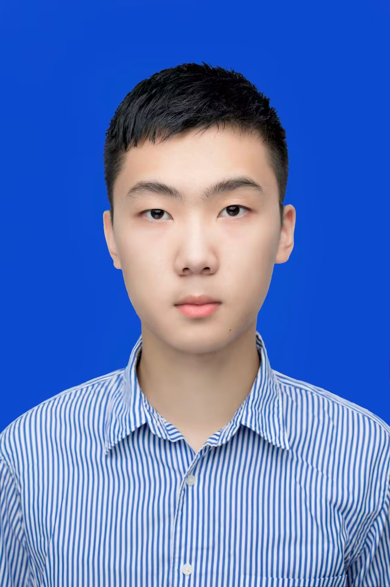
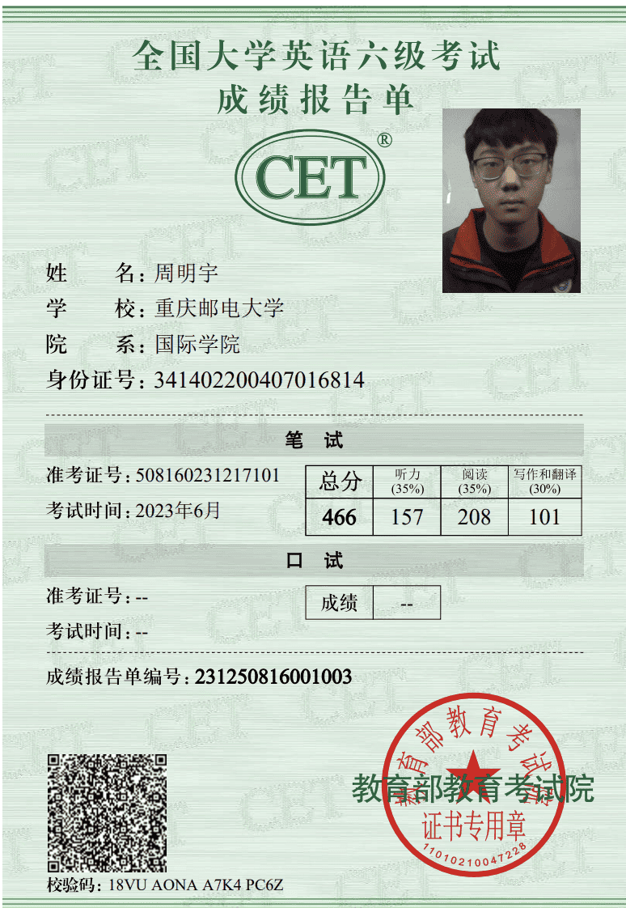
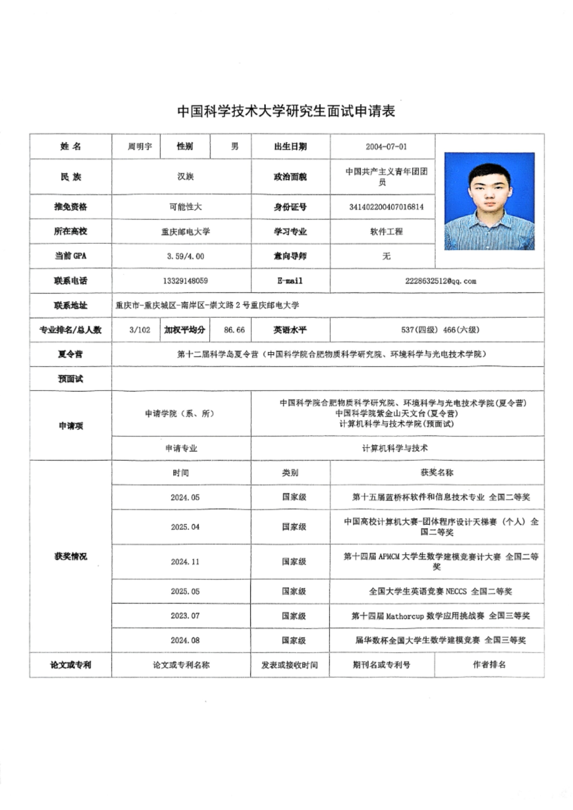
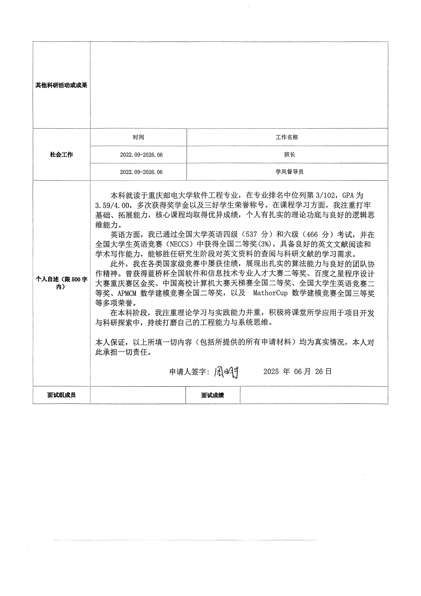
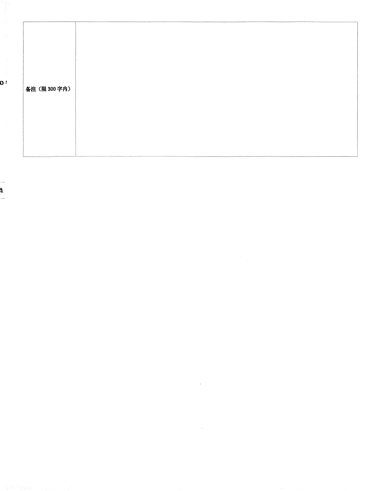
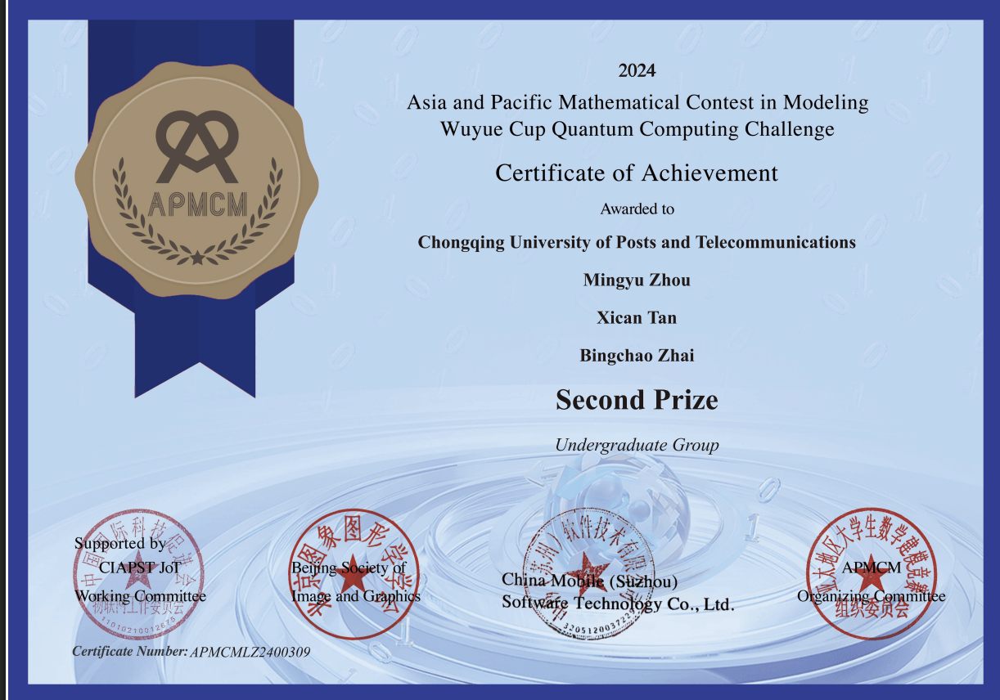
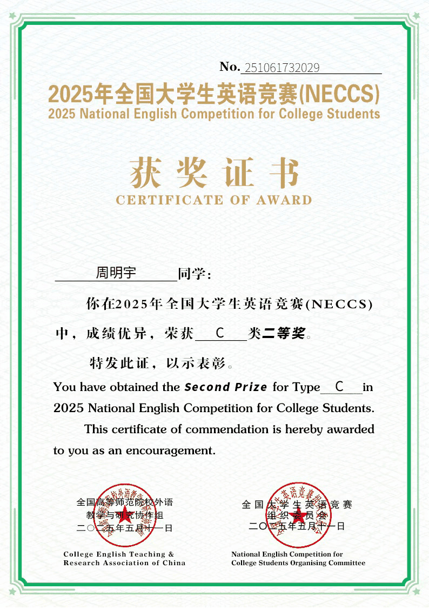
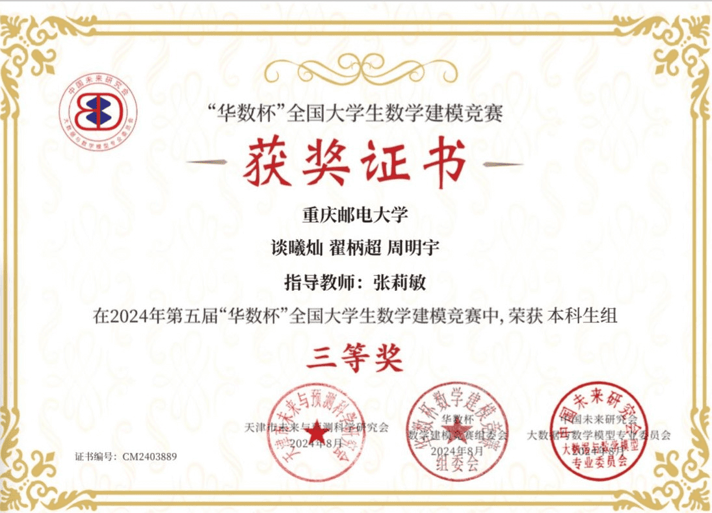
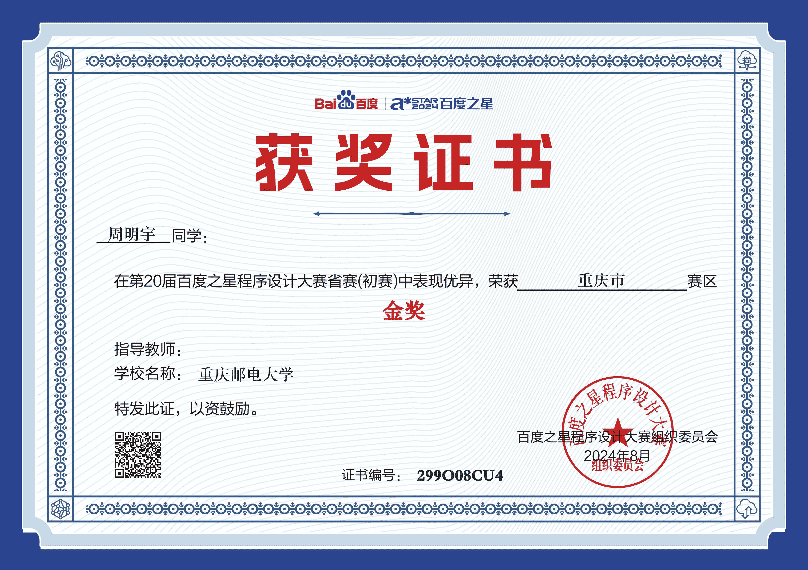

# 个人照片

# 前两年半成绩单与总成绩排名证明

# 英语水平

# 面试申请表

# 获奖证书

### 蓝桥杯全国二等奖

### 团体设计天梯赛个人全国二等奖

### APMCM大学生数学建模竞赛计大赛全国二等奖

### 全国大学生英语竞赛NECCS 全国二等奖

### Mathorcup数学应用挑战赛 全国三等奖

### 华数杯全国大学生数学建模竞赛 全国三等奖

### 百度之星程序设计大赛 重庆市金奖

# PAT甲级

