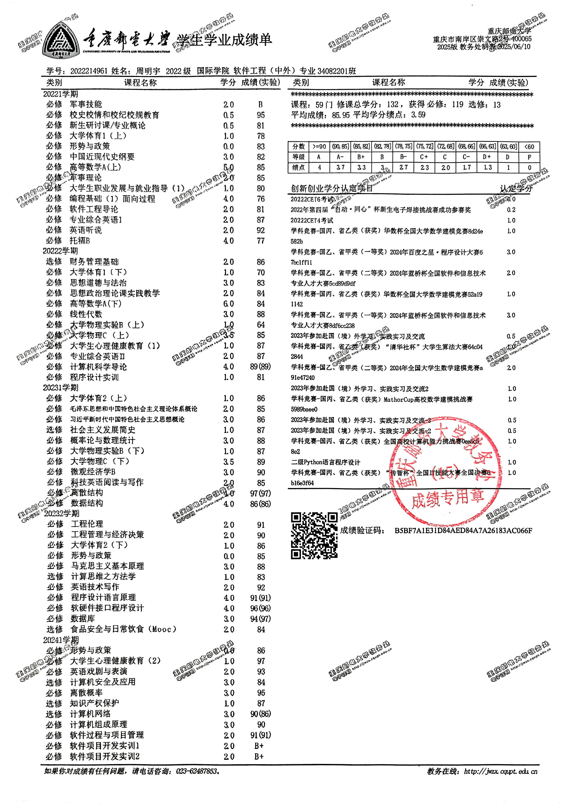
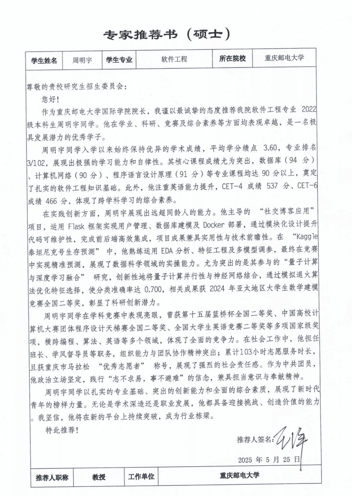
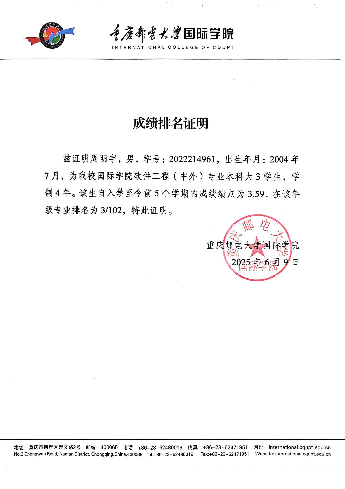
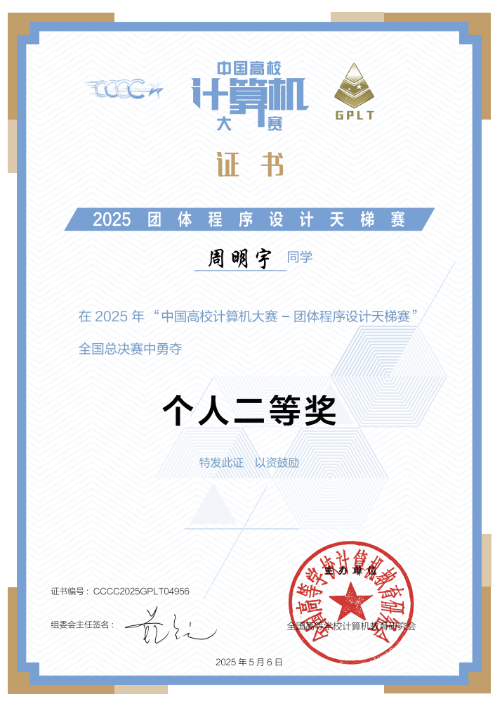
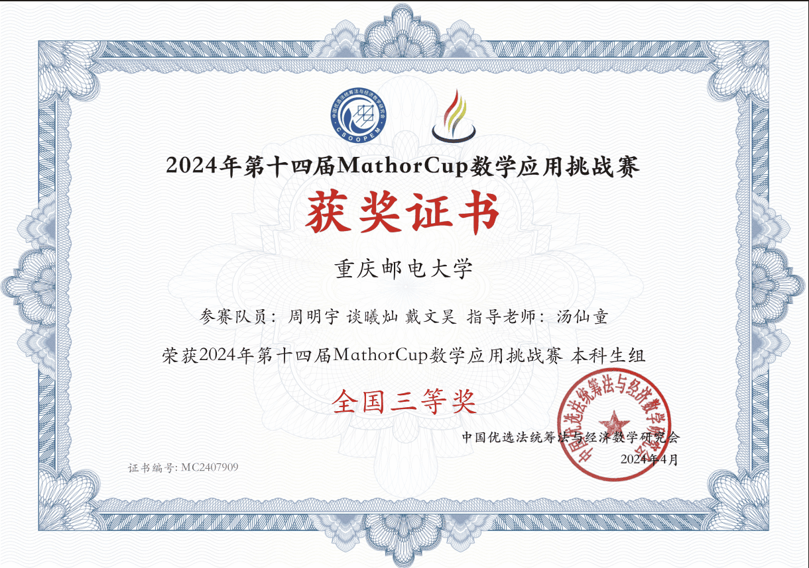
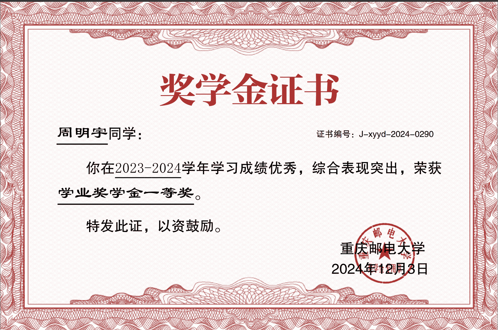

[TOC]

# 本科成绩单

# 副教授以上职称专家推荐信

# 专业排名证明材料

# 英语水平

# 	其他材料

## 获奖证书

### 蓝桥杯全国二等奖

### 团体设计天梯赛个人全国二等奖

### APMCM大学生数学建模竞赛计大赛全国二等奖

### 全国大学生英语竞赛NECCS 全国二等奖

### Mathorcup数学应用挑战赛 全国三等奖

### 华数杯全国大学生数学建模竞赛 全国三等奖

### 百度之星程序设计大赛 重庆市金奖

## PAT甲级

## 奖学金

一等奖学金

通鼎奖学金

三等奖学金

# 个人陈述

