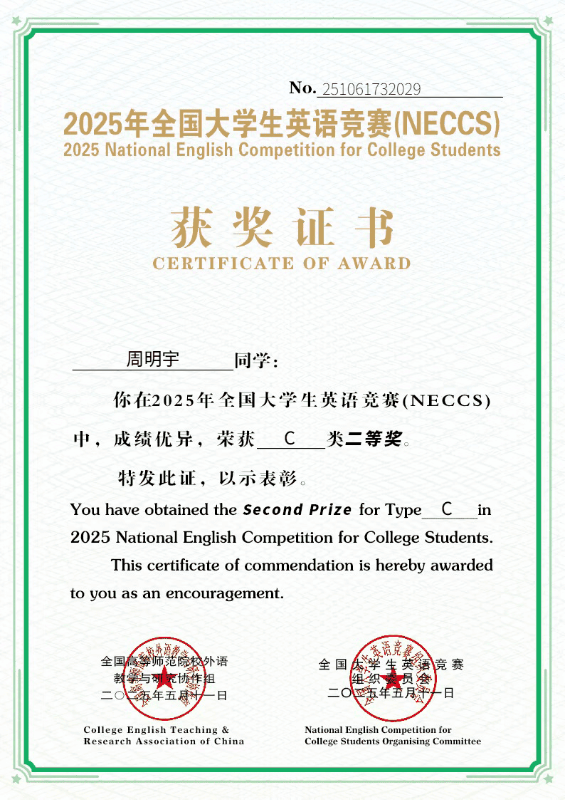
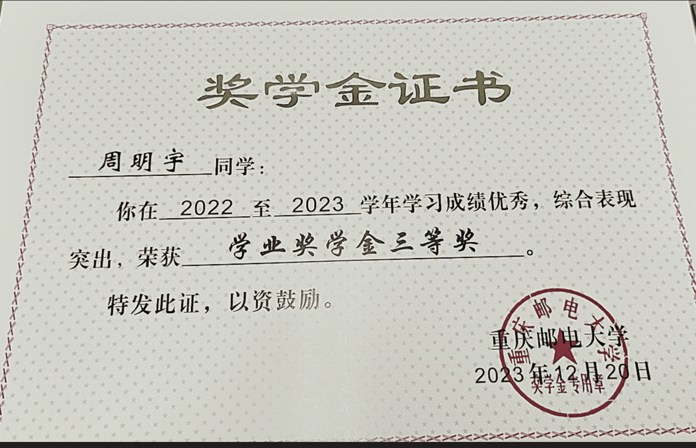

[TOC]

# 本科成绩单

# 副教授以上职称专家推荐信

# 专业排名证明材料

# 英语水平

# 	其他材料

## 获奖证书

### 蓝桥杯全国二等奖

### 团体设计天梯赛个人全国二等奖

### APMCM大学生数学建模竞赛计大赛全国二等奖

### 全国大学生英语竞赛NECCS 全国二等奖

### Mathorcup数学应用挑战赛 全国三等奖

### 华数杯全国大学生数学建模竞赛 全国三等奖

### 百度之星程序设计大赛 重庆市金奖

## PAT甲级

## 奖学金

一等奖学金

通鼎奖学金

三等奖学金

# 个人陈述

## 本科阶段经历

我是来自重庆邮电大学软件工程专业的22级本科生周明宇，目前专业排名第3/102，GPA为3.60/4.00。在校期间，我多次获得奖学金及“三好学生”荣誉称号。学习方面，我注重夯实理论基础，拓宽知识视野，核心课程成绩优异，具备扎实的编程能力与良好的逻辑思维素养。

在英语能力方面，我已通过全国大学英语四级（537分）和六级（466分）考试，并在全国大学生英语竞赛（NECCS）中荣获全国二等奖（前3%），具备良好的英文文献阅读、写作与学术沟通能力，为未来的科研学习打下了坚实的语言基础。

本科期间，我积极参与各类国家级竞赛，取得了丰富成果。例如：蓝桥杯全国软件与信息技术专业人才大赛全国一等奖以及二等奖、百度之星程序设计大赛重庆赛区金奖、中国高校计算机大赛天梯赛全国二等奖、全国大学生英语竞赛二等奖、APMCM数学建模竞赛全国二等奖、MathorCup建模竞赛全国三等奖等。这些经历不仅提升了我的问题建模与解决能力，也锤炼了团队合作与抗压能力。

## 个人能力与实践经验

我在学习之余积极参与工程实践和科研探索，注重将理论知识转化为实际成果。

在软件开发方面，我独立完成了一个功能完备的社交内容平台项目。该系统采用Flask构建后端，支持用户注册、登录、发文、评论、关注等核心功能。我采用蓝图机制进行模块化设计，有效实现了用户管理、内容管理和评论系统的解耦，并使用Docker进行容器化部署，确保系统的可移植性与部署一致性。该项目大大提升了我在全栈开发、系统架构设计和工程实现方面的能力。

针对数学建模竞赛中提出的高维数据下特征选择难题，团队探索将量子模拟退火方法引入特征筛选流程。以德国信用评分数据为研究对象，构建融合“最大相关性-最小冗余性”（mRMR）信息论准则的 QUBO 模型，并借助 Kaiwu SDK 提供的量子启发式模拟退火算法进行求解，突破传统方法在冗余控制与局部最优上的局限。最终构建的逻辑回归模型在验证集上表现优异，充分验证了该融合方法在金融风控领域的可行性与应用价值。

此外，我还独立完成了Kaggle泰坦尼克号生存预测项目，从数据清洗、EDA分析、特征工程到多模型对比与调参优化，完整经历了一个标准的机器学习流程，并在公开测试集中取得了理想成绩，增强了我对数据建模流程的理解。

在组织管理方面，我曾担任班长及学习小组组长，组织多次学风建设与学术交流活动，具备良好的沟通协调与团队管理能力。同时，我累计参与志愿服务超过100小时，并荣获“优秀志愿者”称号，展现了较强的社会责任感与执行力。

## 研究生阶段规划

我的研究兴趣主要集中在大模型在各类实际场景中的应用探索，特别关注其在教育、医疗、金融等行业的落地方式与工程实现。

我对研究生阶段的目标非常明确：希望通过真实的科研训练，检验自己是否适合长期从事科研工作。

具体而言，我期待能在导师的指导下尽早参与科研课题，脚踏实地积累研究经验，力求在硕士阶段取得阶段性成果并发表高水平论文。这不仅有助于我提升科研素养，也能帮助我进一步明确未来发展方向——如果在过程中发现自己确实热爱科研，具备持久的投入动力，我将考虑继续攻读博士学位，拓展更高层次的学术视野；若发现自己更适合实践应用型岗位，我也会及时调整规划，发挥工程优势，进入有技术挑战的大型企业从事研发工作。

我对未来保持开放态度，也会在研究生阶段稳扎稳打，不设限、不盲目，依据真实表现与内心判断不断校准方向，努力实现学术理想与职业发展的双重突破。
