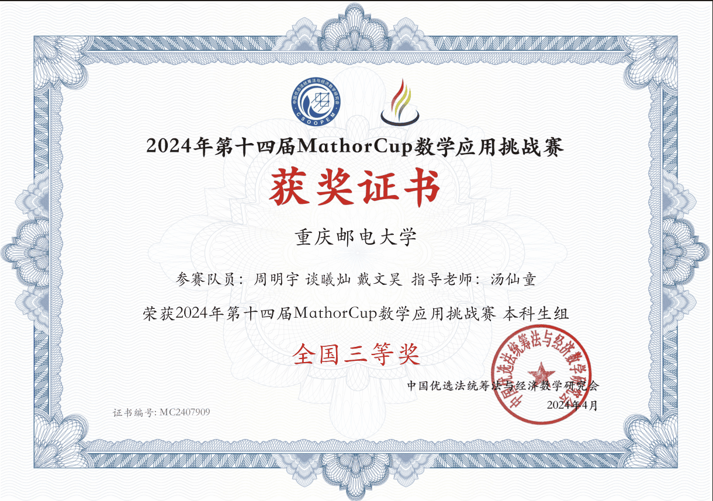

# 吉林大学2025校园学术活动开放日报名表

# 本科成绩单

专业排名证明材料

# 其他材料

## 获奖证书

蓝桥杯全国二等奖

团体设计天梯赛个人全国二等奖

APMCM大学生数学建模竞赛计大赛全国二等奖

全国大学生英语竞赛NECCS 全国二等奖

Mathorcup数学应用挑战赛 全国三等奖

华数杯全国大学生数学建模竞赛 全国三等奖

百度之星程序设计大赛 重庆市金奖

## 英语水平

#

## PAT甲级

## 奖学金

一等奖学金

通鼎奖学金

三等奖学金

# 未来研究方向及科研计划

我希望未来的研究方向聚焦在边缘智能系统的模型压缩与部署优化。随着物联网设备和智能终端的快速发展，AI 应用正从云端逐步向边缘侧迁移，广泛应用于智能摄像头、无人机、车载系统、工业制造等场景。然而，主流深度神经网络模型往往参数庞大、计算复杂，难以直接部署在边缘设备上，亟需在有限资源条件下实现高效、低功耗、稳定的本地智能推理。

边缘智能作为人工智能与嵌入式系统的交叉方向，兼具挑战性与实践价值。我对这一方向充满兴趣，并希望未来能够围绕以下几个方面展开深入学习与研究：

首先，系统掌握轻量化神经网络的结构设计思路与模型压缩方法，例如剪枝、量化、知识蒸馏等主流技术，理解其在性能与精度之间的权衡逻辑；其次，学习主流边缘部署工具链，如 TensorRT、ONNX、TVM 等，并逐步掌握模型从训练、转换到部署的完整流程；第三，在特定应用场景（如工业视觉检测、车载识别系统等）中，探索算法设计与硬件平台的协同优化方法，提高实际部署效率；最后，结合导师课题组安排，参与已有项目的数据预处理、模型测试与性能评估工作，积累科研实践经验，并逐步尝试撰写调研综述或技术总结报告。

目前，我具备扎实的程序设计基础，具备较强的学习能力和研究热情。在专业课程中，我特别重视《人工智能导论》《计算机系统结构》《嵌入式系统》等相关内容的学习，为未来深入该方向打下了理论基础。

我希望能在吉林大学人工智能学院的指导下，进一步拓展视野，提升能力，逐步构建起从算法设计到系统实现的完整知识体系。边缘智能是AI真正落地的关键路径之一，我愿意从基础做起，夯实能力，持续探索，未来能为智能系统的高效部署与广泛应用贡献自己的力量。

