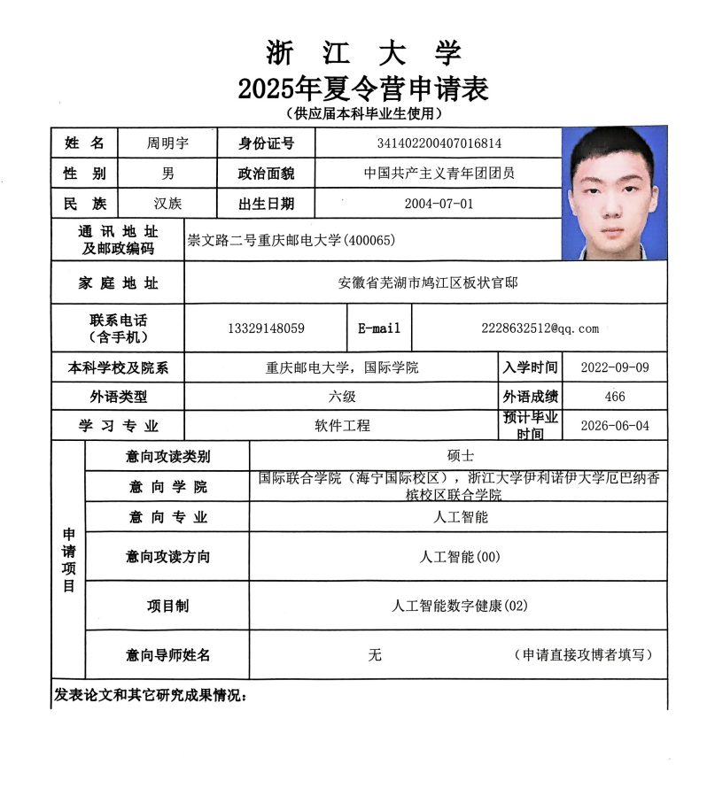
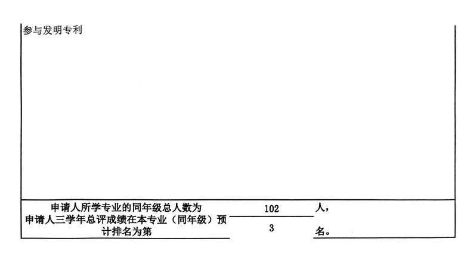
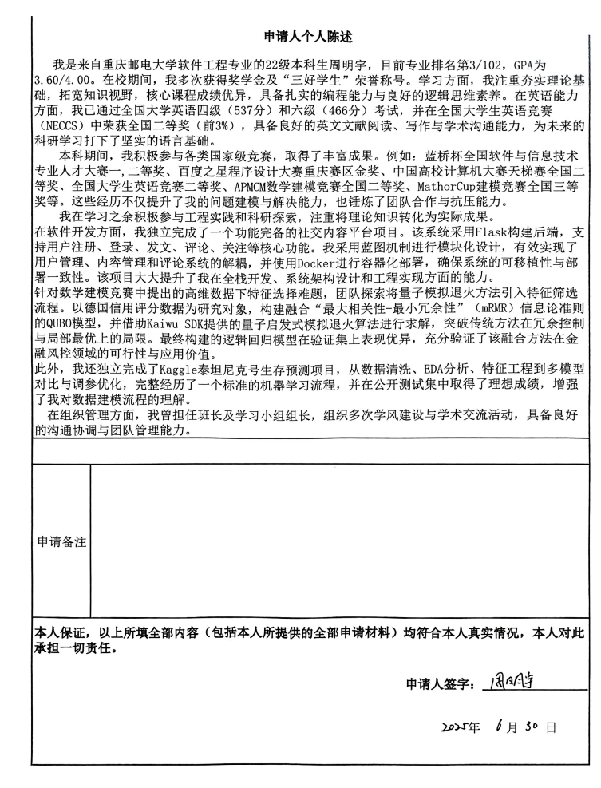
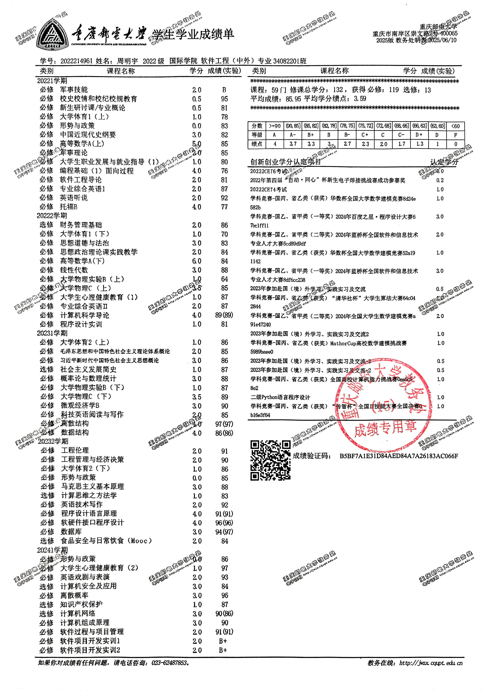
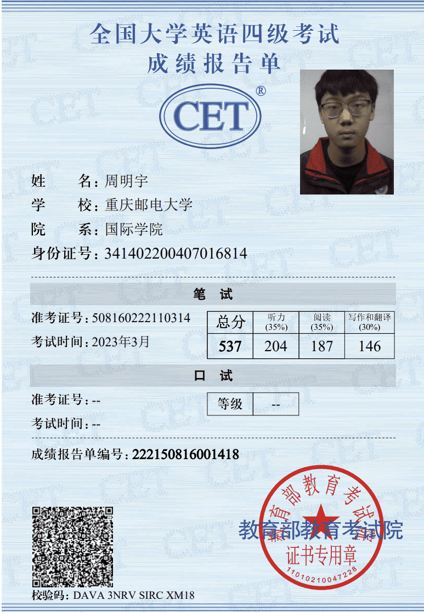

## 夏令营申请表

​                            

## 个人身份证正反面复印件

## 本科成绩单

## 专业排名证明材料

## 英语水平

​                                 

## 其他材料

### 获奖证书

蓝桥杯全国二等奖

团体设计天梯赛个人全国二等奖

APMCM大学生数学建模竞赛计大赛全国二等奖

全国大学生英语竞赛NECCS 全国二等奖

