# 个人身份证明

# 本科现阶段成绩单

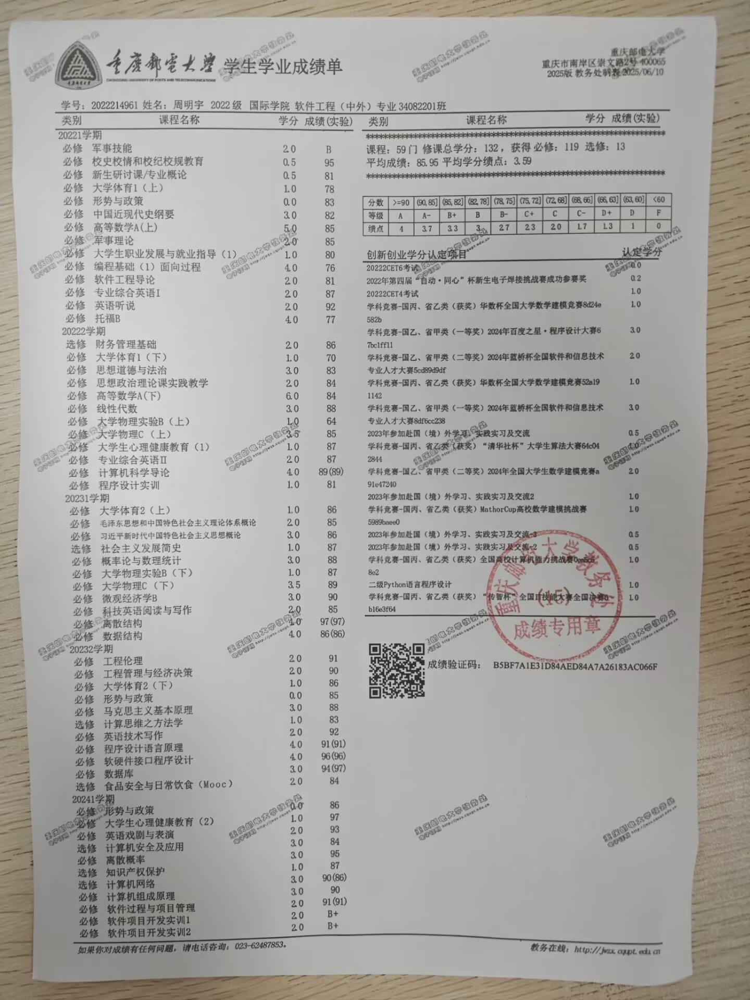

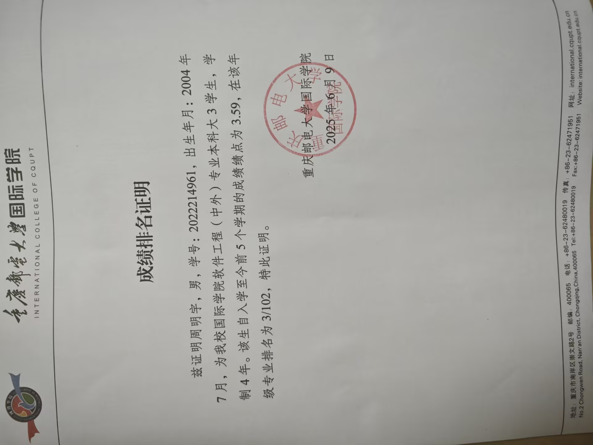

# 获奖证书

蓝桥杯全国二等奖

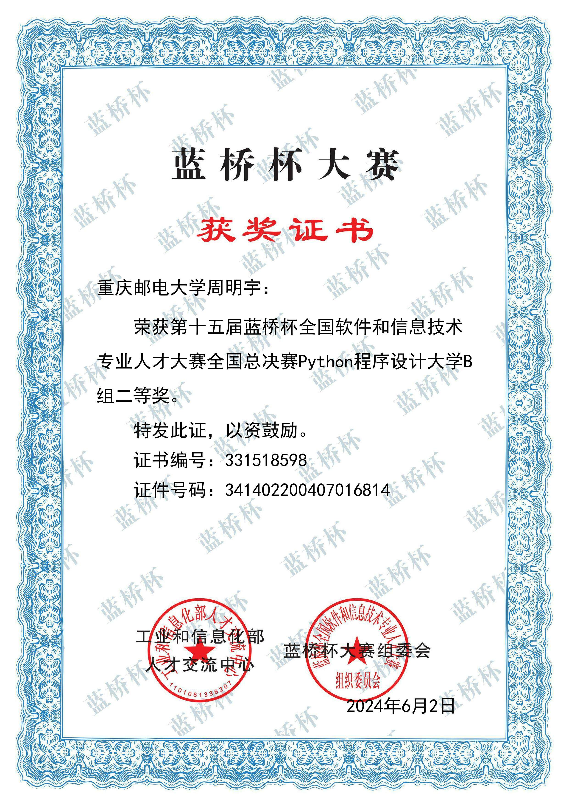

团体设计天梯赛个人全国二等奖

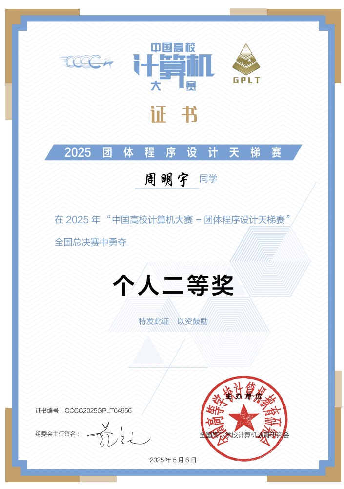

APMCM大学生数学建模竞赛计大赛全国二等奖

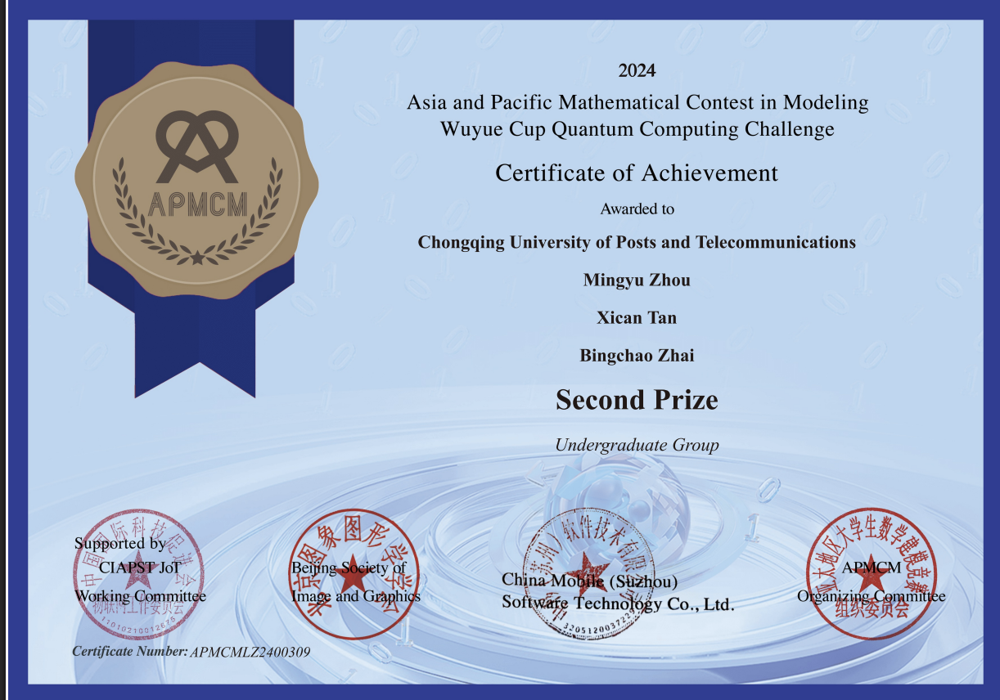

全国大学生英语竞赛NECCS 全国二等奖

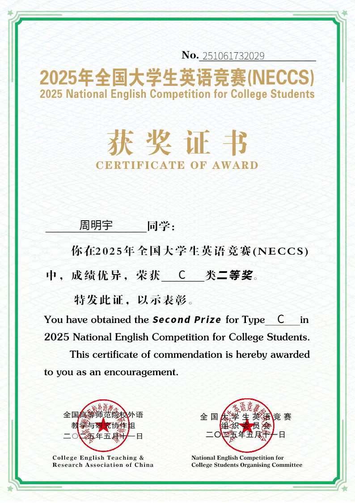

Mathorcup数学应用挑战赛 全国三等奖

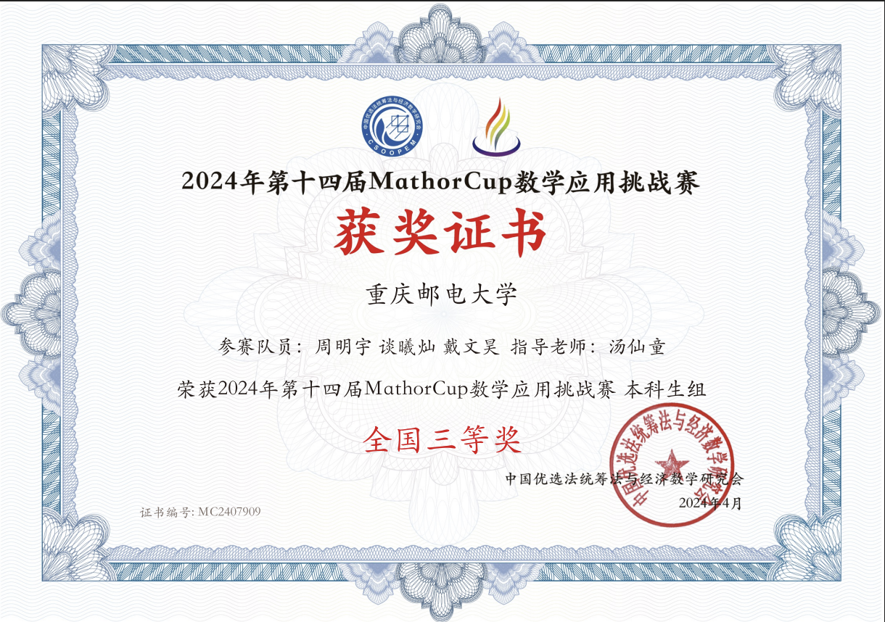

华数杯全国大学生数学建模竞赛 全国三等奖

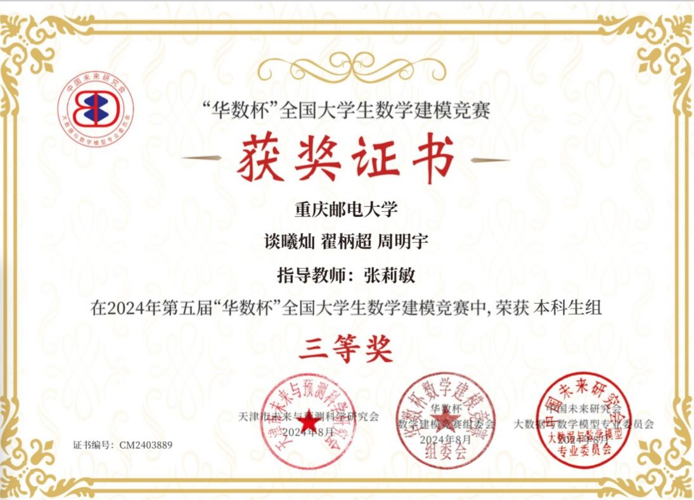

百度之星程序设计大赛 重庆市金奖

# 英语四级+六级

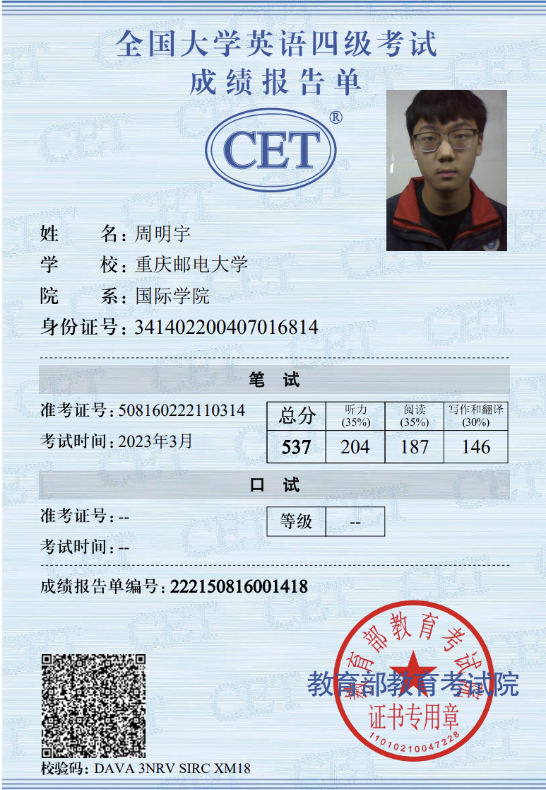

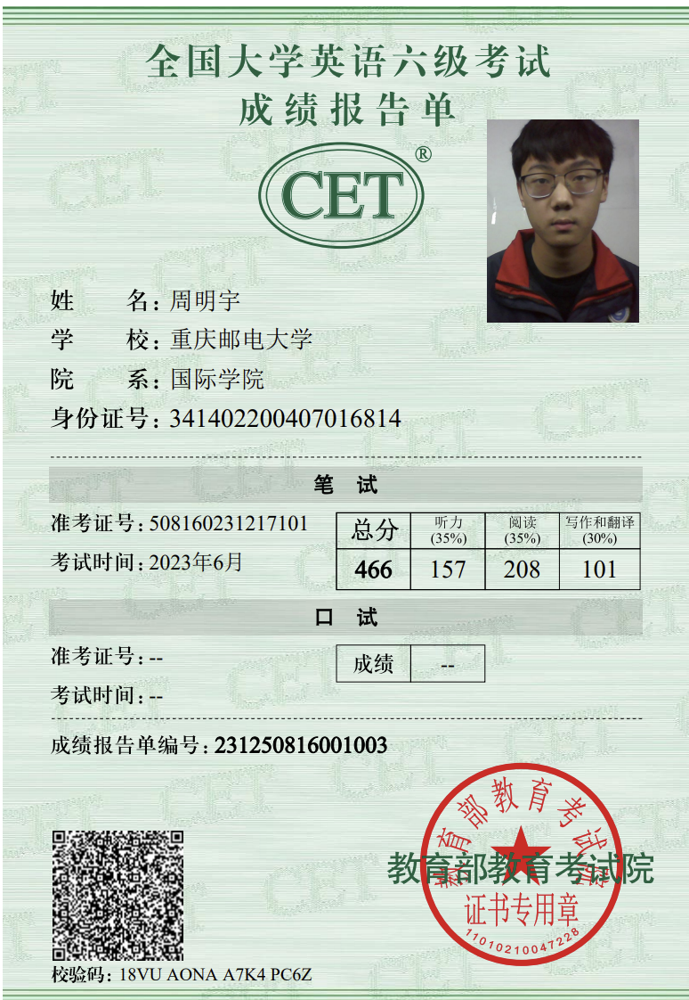

# PAT甲级

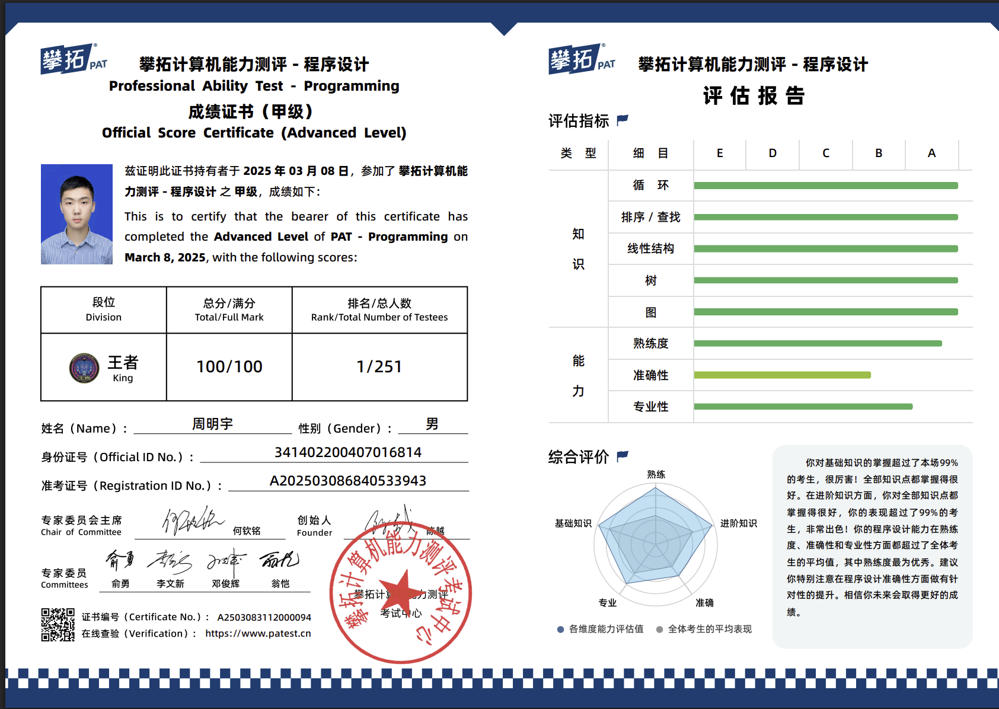

# 奖学金

一等奖学金

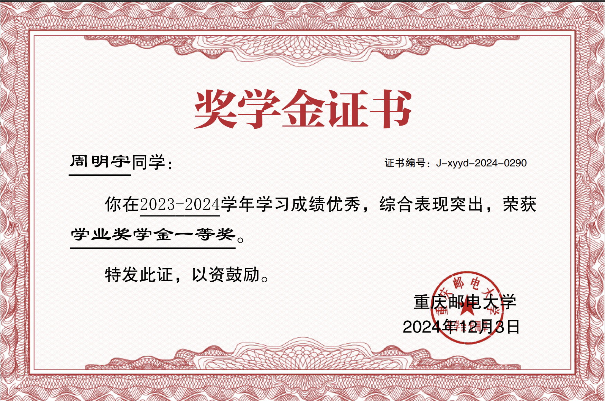

通鼎奖学金

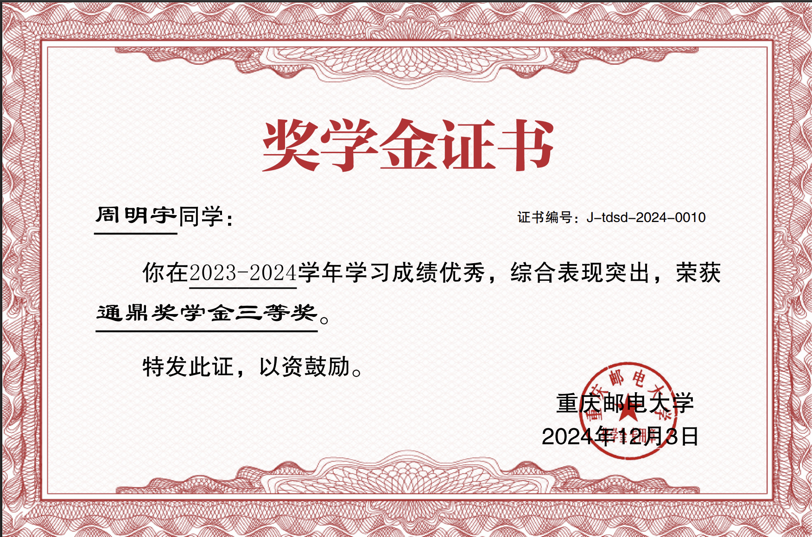

三等奖学金

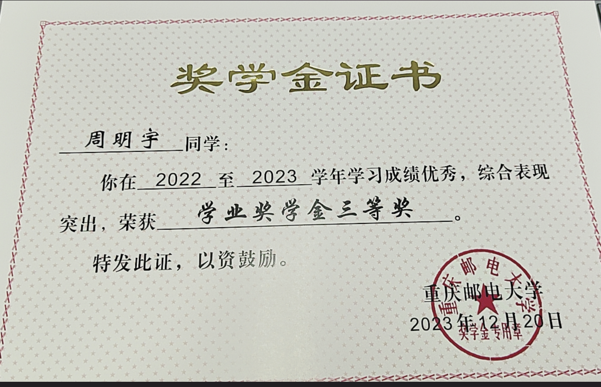